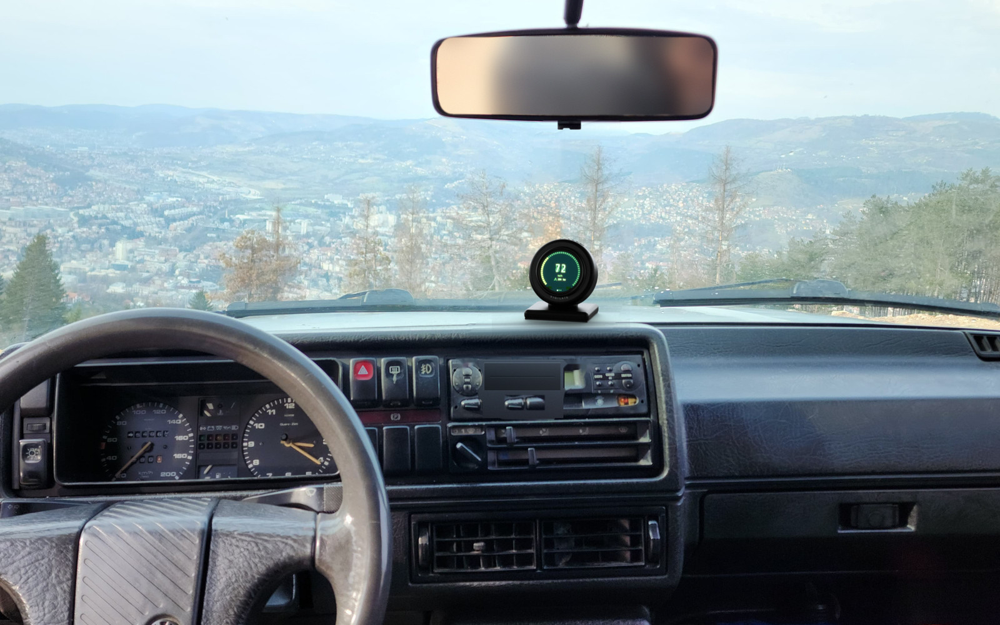
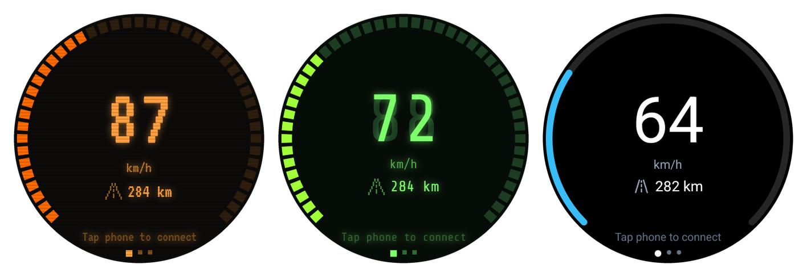
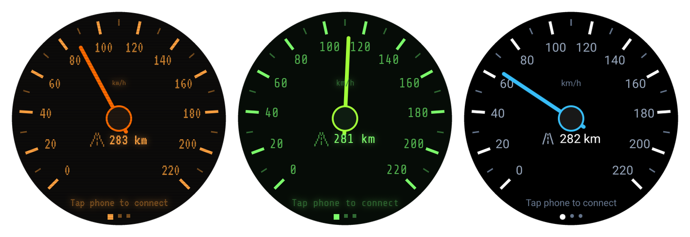
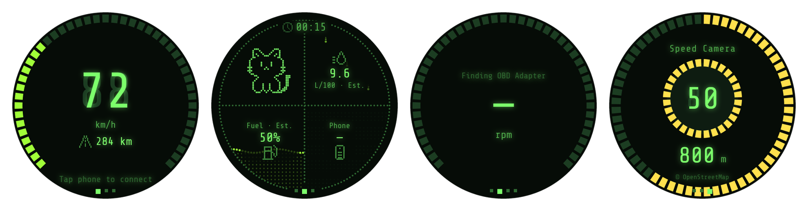
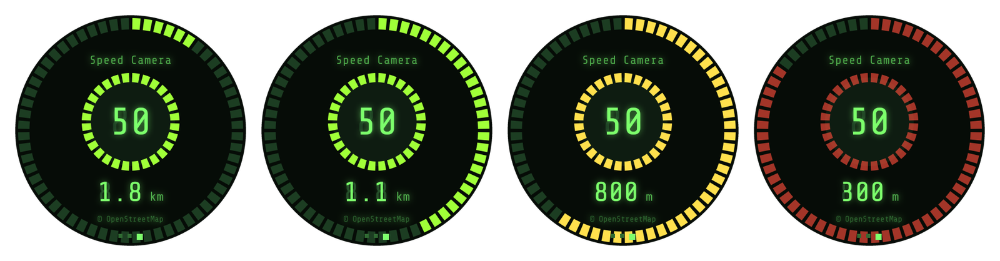
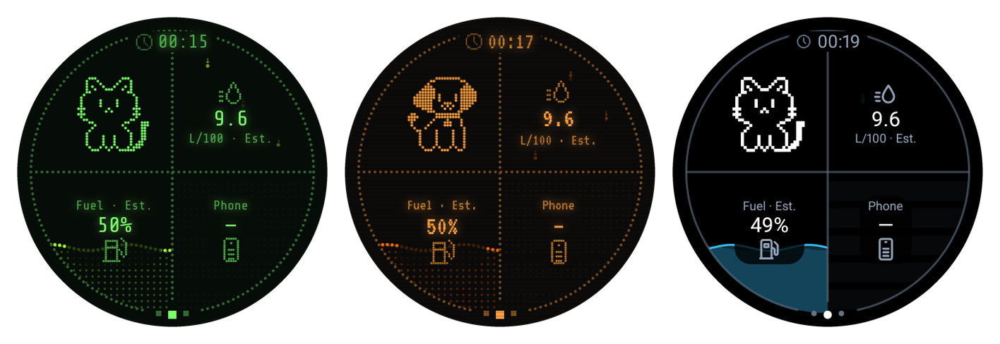
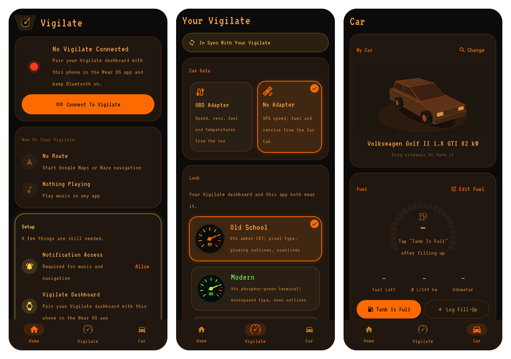
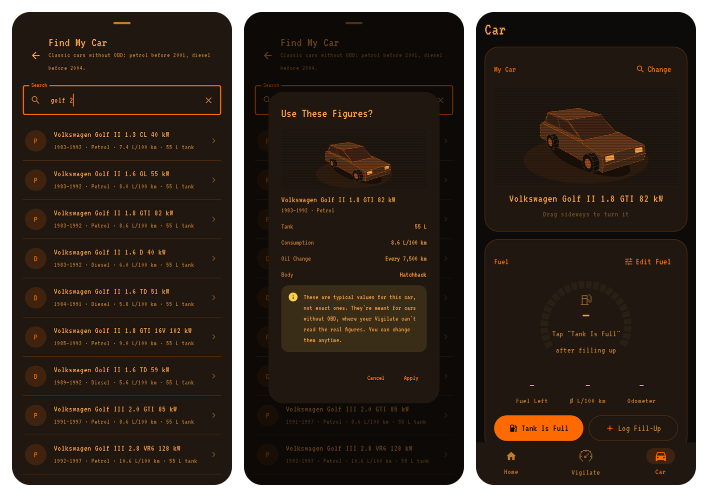
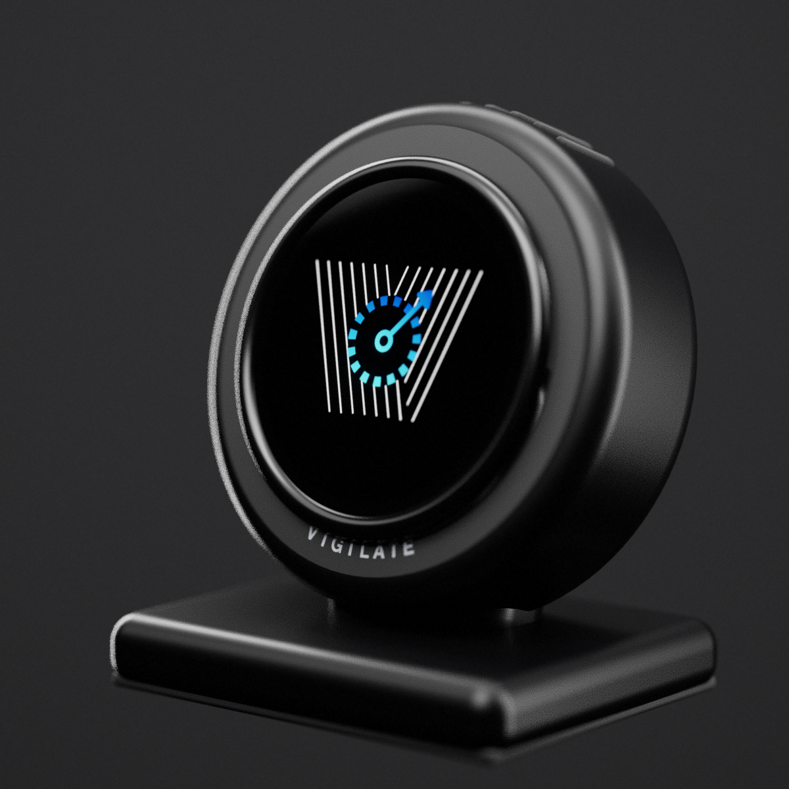
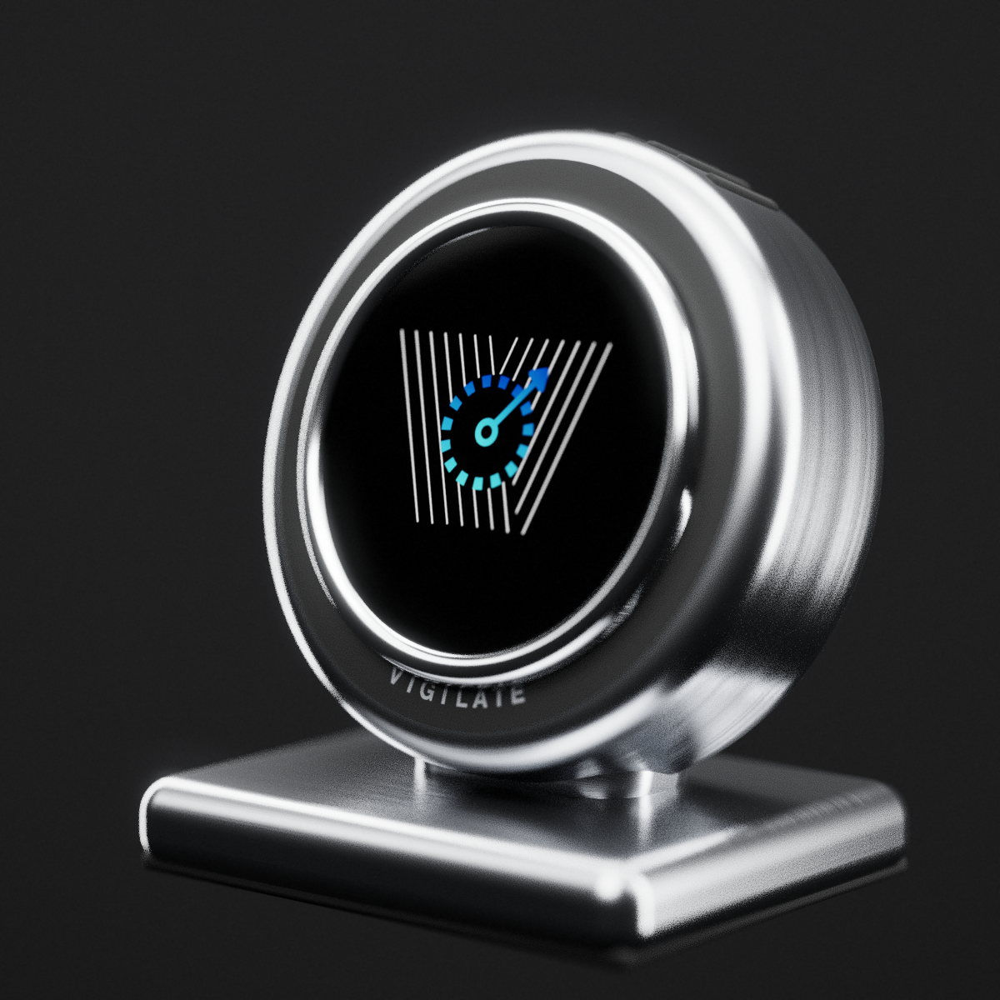

  

<h1 align="center">Vigilate</h1>

  <b>The digital dashboard your classic car never had.</b> 
  Speed, range, fuel, speed cameras, navigation and music on one round screen, made to fit in.

  

---

## Made for cars with character

Old cars have beautiful gauges, but no range, no trip computer, no service reminders and no
navigation in sight. Vigilate brings them in, with no cutting, no wiring into the dashboard and no
screen that looks out of place.

- **Fits any car.** Reads the car itself through its diagnostic port, or works fully on GPS in
  cars built before diagnostics existed.
- **Read at a glance.** One big number or needle per screen, made to be read from the driver's seat.
- **Set up once.** Connect your phone with a single tap, then just drive.
- **Your phone stays in your pocket.** Turns and music appear on Vigilate, and the phone stays locked.

## Three looks

Pick the style that suits your car, with digital numbers or classic needles.

  
   <b>Old School</b>: 80s amber glow · <b>Modern</b>: 90s green terminal · <b>Postmodern</b>: clean black and white

  

## Everything you need, one swipe away

  

- **Speed**: big and clear, with your remaining range underneath.
- **Quarter**: four things at once, chosen by you: fuel, consumption, engine and outside
  temperature, tyre pressure, phone battery.
- **RPM**: a full-size tachometer.
- **Speed cameras**: the next camera ahead, its limit and distance.
- **Navigation**: the next turn from Google Maps or Waze.
- **Music**: what's playing, with play, pause and skip.

## Speed-camera alerts

Vigilate knows more than 78,000 speed cameras worldwide, built in, so it works without signal.
Only cameras ahead of you count. As you approach, Vigilate brings up the camera screen and turns
from calm to warning to alert.

  

## Meet Cezar and Lesi

A little companion lives in one corner of your dashboard: **Cezar** the cat or **Lesi** the dog.
They blink, wag and look around, and remind you when the next oil change or inspection is due.

  

## Your car, in the app

The Vigilate app sets everything up. Choose your look, arrange your screens, and find your car in
a library of more than 1,000 classic models. Vigilate then knows its tank, consumption and service
intervals, and shows you a small 3D model of it.

  

  

## The unit

A small round screen in a solid casing that sits on top of your dashboard. Two finishes:

<table>
<tr>
<td align="center"> <b>Satin Black</b></td>
<td align="center"> <b>Stainless Steel</b></td>
</tr>
</table>

---

<b>Vigilate is in development.</b> Pictures of the unit in the car are concept renders.

Speed-camera alerts may not be used while driving in some countries (for example Germany).
Please follow local law.
